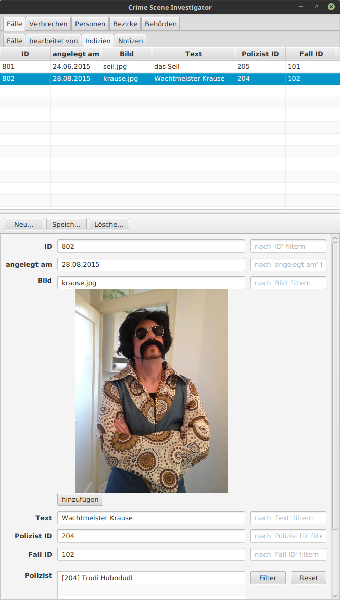

# Crime Scene Investigator v0.1

JavaFX based toy GUI-application to model a crime investigation database system.

### Voraussetzungen

Benötigt wird eine Java Runtime 8+ mit JavaFX 2.2+. Als Datenbank Backend wird ein laufender
Sqlite3-Server vorausgesetzt. Der Bilder-Ordner img/ und die Datenbank crime.db müssen sich im
selben Verzeichnis befinden wie das JAR-File.

### Änderungen v0.1

- Die externe JDBC-Bibliothek ist nun bereits im JAR-Archiv enthalten. 
For a most recent SQLite JDBC Driver refer to
[https://github.com/xerial/sqlite-jdbc](https://github.com/xerial/sqlite-jdbc).

### Ausführung

##### Windows:
- Doppelklick auf csi.jar

##### Linux:
- von der Konsole: java -jar csi.jar
(bei Start über Doppelklick ist es möglich, dass der Pfad zur Datenbank nicht korrekt interpretiert
  wird.)

### Kurzanleitung

1. Über die Tabs werden die Relationen ausgewählt.
Die Relationen wurden in sinnvolle Gruppen zusammen geführt.

2. Im unteren Bereich (Editor) können Werte geändert werden (Textfelder links)
oder die Tabelle nach Werten gefiltert werden (Textfelder rechts).

3. Ein neuer Eintrag kann über "Neu..." erstellt werden.
Einträge werden über "Speichern..." in die Datenbank geschrieben.
Pflichtfelder müssen gesetzt sein, sonst wird der gesamte Eintrag nicht gespeichert.
"Löschen..." löscht den ausgewählten Eintrag.

### TODO

+ alle Personen-Tabellen aktualisieren, wenn ein Wert gespeichert wurde.
+ Dienstgrad wird nicht korrekt angezeigt
+ Polizisten können noch nicht gespeichert werden
+ filtern funktioniert nicht mit `like`
+ `delte` bei beziehungen löscht zu viele Tupel
+ updates bei den beziehungen sollten die relationen-Tabellen refreshen
+ Datums-Angaben teilweise nicht korrekt (unerwünschte Subtraktion).
+ Verbrechen nach Bezirk (Name!) filtern können
- Bild bei Indizien
- Selektfeld für 'Geschlecht'
- Selektfeld für 'überführt'
- Verbrechen: Art sollte Selektfeld sein
- 'liegtin' in Bezirke integrieren
- Datefeld für Daten
- Multiline Textfelder für längere Texte
- ID wird nicht auf gleichheit gefiltert
